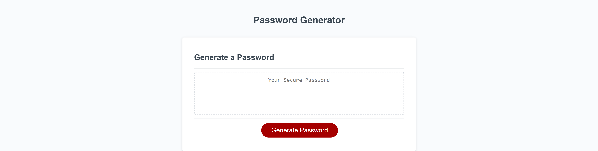

# password-generator-js

## Description

Modifying an existing code of a password generator on JavaScript.
Added more functions, window alerts and window confirms to ensure the password generates. Modified password so user can choose any random character. It asks four questions regarding the password the user wants to generate using special characters, numeric characters, upper cased and lower cased characters.

## Screenshot of modified password generator

## Link to Password Generator

- https://jovaldez98.github.io/password-generator-js/

## Credit
- Diarmuid Murphy (Instructor)
- Andrew Mason (Tutor)

# Resources
- https://www.w3schools.com/jsref/jsref_push.asp

